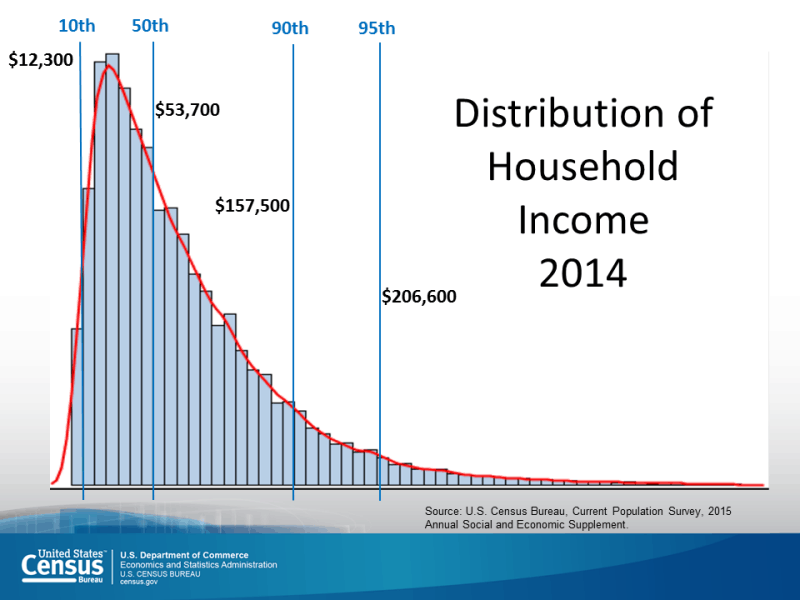

# Miscellaneous-ML-and-Python

## The solution to the problems which I encounter while solving AI/ML/Python usecases.

### Parsing a large json file
- Parsing a large json file which doesn't fit into memory is difficult.
- It can be done using a package called **`ijson`**. ijson will iteratively parse the json file instead of reading it all at once. This is slower than directly reading the whole file in, but it enables us to work with large files that can't fit in memory.

### Constructing pandas DataFrame from a dictionary gives `“ValueError: If using all scalar values, you must pass an index”`
- The error message says that if we're passing scalar values, we have to pass an index. So we can either not use scalar values for the columns -- e.g. use a list:

```python
df = pd.DataFrame({'A': [a], 'B': [b]})
>>>df
   A  B
0  2  3
```
or use scalar values and pass an index:

```python
df = pd.DataFrame({'A': a, 'B': b}, index=[0])
>>>df
   A  B
0  2  3
```

- Notebook : [notebooks/dict_to_dataframe]
- Reference : https://stackoverflow.com/questions/17839973/constructing-pandas-dataframe-from-values-in-variables-gives-valueerror-if-usi

### Writing a Decorator in Python
Decorator allows us to augment an existing function with extra code, without requiring us to change the existing function's code.

**4 things we need to understand to write a decorator**
- How to create a function
- How to pass a function as an argument to another function
- How to return a function from a function
- How to process any number and type of function arguments

### Mathematical transforms
- We can apply multiple mathematical transforms on numerical features like log(x), sqrt(x), apply polynomial transforms like (x2, x3, x4) or trignometric transformations like sin(x), cos(x) or tan(x).
- Question is what is the best transform. Its very problem specific, and we need to have domain knoweledge. If feature x has **powerlaw distribution**, taking something like log(x) makes sense because it converts it roughly into powerlaw distribution. Not always but close to a gaussian distribution.



- A power law distribution looks like above with a long fat tail.
- Log is one of the cases of a box-cox transform.
- Logistic Regression is nothing but gaussian naives bayes with a bernoulli distribution on yi, which works very well if our features are gaussian distributed.

### Model specific featurizations
- Logistic regression assumes that the features are Gaussian distributed. If feature is power law distributed, it makes sense to transform feature f1 into log(f1).
- If we have features which have linear relationships i.e y=f1-f2+2f3 ,and we know this by domain knowledge. Then decision Trees can't really capture this relationship exactly.
- When we know that the interactions matter more in predicting dependent variables like interaction between f1 & f2 i.e to predict gender height & weight interact well we can use Random Forest or DT or GBDT.
- If we have text data and if we use Bag of words, linear models tend to perform very well. Because when we do BOW we end up having very high dimensional space. Bcz we can easily separate hyperplanes the +ve and -ve hyperplanes.

### Feature orthogonality
- The more different/orthogonal the features are the better the model is.
- When engineering new features we should take care that they are not correlated with each other.
- If we engineer a new feature f4 which is correlated with the error(ei) = (yi - yi^). Then adding this feature will boost the model performance, which actually is similar to Gradient boosting DT.

### Feature engineering : Indicator variable
- If we have height as a feature. We can use the height as a real valued feature as it is or there is an other alternative.
- If h>150 return 1 or h <= 150 return 0. Here instead of using height as a real valued feature we are converting it into binary indicator variable feature.
- This is very problem and domain specific.

### Feature engineering hack : feature binning or bucketing
- Logical extension to indicator variable. if h <120 return 1, if h < 150 and h >- 120 return 2, if h < 180 and h >= 150 return 3 and h > 180 return 4.
- Task : predict gender given : height, weight, hair length, eye color. **Challenge in binning is how to arrive at appropriate thresholds**.
- Suppose we want to do binning on height variable, then a very good solution is to consider only height and dependent variable gender, then build a **Decision tree** with these two columns. Decision tree finds these **thresholds** using Information gain. Corresponding to every leaf node we have a category.
- Here we binned real-valued features using yi's & features itself using Decision Trees.
- Use thresholds that decision tree finds to perform binning.

### Feature engineering : Creating interaction variables
- Task: using height, weight, hair color, eye color predict gender.
- if (h < 150) and (w < 60) -> 2 way interaction feature.
- height * weight -> new feature. (problem specific)
- sqrt(h) * w or h < 50 and w < 65 and hairlenght > 93
- Given a task how do we find good interaction features ? -> Using Decision trees.

### Feature slicing
- Suppose we have a categorical variable country having 2 countries USA and India. If 80% is India and just 20% is USA. Then model tends to better on majority data i.e India.
- If we check for density plots (distribution) of errors, if errors for USA is more, then the strategy here is **slice the data and create a separate a new dataset for India and train model M1 on it and slice Data from USA and create model M2 on it**.
- This is beneficial to actually train one model for people from India and one model for people from US.
- **At runtime**, we  will already get the value for country or accordingly select appropriate model.
- So for applying this, the category 1 and category 2 should be different and there should be sufficient number of  points for each category.
- Example : at internet companies there is data from desktop users and mobile users.

### Retraining models
- If the cost of retraining is high, we need to check if the model performance is dropping with time, we should consider retraining it.
- If dataset itself is changing, i.e it has different distributions on day 13 or day 14. Such data is called non-stationary data.


### Productionizing ML models
- To acheive low latency in production we can convert the logistic regression weights into a hash table or dictionaries. And simply read the weights from there and apply sigmoid. **sigmoid(Wi, Xi) = yi**.
- In case, of Decision Trees or Random forest, we can store the if else statements and execute them in C/C++/Python/Java.

### hyperparameter tuninh

#### Informed search : Coarse to Fine

##### Informed vs Uninformed searched
- Grid search and Random search are instances of uninformed search. When performing uninformed search, each iteration of hyperparameter tuning (each model) does not learn from the previous iterations. This allows us to parallelize our work. However doing so much work before being able to learn and iterate seems a bit inefficient.
- We have been creating all the models at once and collating their scores before deciding the best at the end. An alternate approach would be to build models sequentially, learning from each iteration.


- This is what undertaking hyperparameter searching in an informed way allows us to do.

#### Coarse to Fine tuning
- A first basic, informed search methodology is known as 'Coarse to Fine tuning'. It means start with a rough approach and iteratively refine hyperparameter search.

1. Random search
2. Review results to see promising areas in hyperparameter search space.
3. Then undertake a grid search in a smaller area.
4. Continue this process until an optimal score is obtained or the area becomes too small (meaning not many hyperparameter values) to properly search.

- We can also substitue the step 3 with further random searches before the grid search.

#### Advantages : Coarse to Fine tuning
- Optimizes the advantages of grid and random search. It uses the advantages of both methods. 
- The wide searching abilities of random search and including a grid search for deeper coverage at the relevant time.
- If we see one area on the grid is producing poor results, we will undertake our next search elsewhere, saving our effort.
- Also note that Coarse to fine is not informed on every model, but on batches of models. Still, it is more informed.

#### Undertaking Coarse to Fine
- Let's take an example with the following hyperparameter ranges:
- `max_depth_list` between 1 and 65, `min_sample_list` betwn 3 and 17, `learn_rate_list` 150 values between 0.01 and 150.
- How many possible hyperparameter combinations are there?  134,400 possible combinations.

```python
combination_list = [list(x) for x in product(max_depth_list, min_sample_list, learn_rate_list)]
print(len(combination_list))
```

#### Visulaize Coarse to Fine
- Rather then running all these combinations, we can do a random search on just 500 combinations.
- Let's first visualize just the accuracy column as a density plot.


- There are certainly some bad models in there. Good thing we didn't do a huge grid search and waste our time on those.
- But there are some good models in there, what hyperparameters did they use?
- Snapshot of top models of the results dataframe, although they don't provide some good overview.


- Instead, let's visualize each hyperparameter against the accuracy scores to see if we can see any trends.Visualizing scatter plots helps.

#### The next steps
- What we know from iteration one: `max_depth` between 8 and 30. `learn_rate` less than 1.3. `min_samples_leaf` less than 8. All tend to have higher accuracies.
- We can take this and undertake a more refined grid search or even another random search around these values to improve the model.
- This simple bivariate graphing was insightful, but using advanced visualization techniques could prove useful.

### Informed Methods : Bayesian Statistics
- *Bayes rule* : A statistical method of using new evidence to iteratively update our beliefs about some outcome.
- Intutively this makes sense as when using informed search we want to learn from evidence to make our hyperparameter better.

#### Bayes in Medicine
- A medical example to illustrate the Bayesian process. 
- Let's day 5% of the people in the general population have a certain disease. THis is our P(D), probability of disease. 
- 10% of people are genetically predisposed to this condition. i.e, because of their genetics they are more likely to get this condition. This is our P(Pre), probability of pre existing condition.
- 20% of the people with the disease are predisposed. P(Pre|D) , probability of predisposition given that they have the disease.
- So what is the probability that any given person has the disease?. If we know nothing about a person, then the probability of them having the disease is just the prior. However, what if we add some new evidence that this person is predisposed? We can update our beliefs by subbing into Bayes formula.

#### Bayes in Hyperparameter Tuning
- We can apply this logic to hyperparameter tuning using following process:


